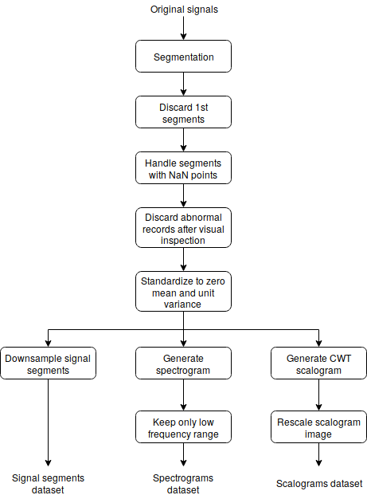

# Deep Learning for neurodegenerative disease classification using gait data

This repository contains code, Jupyter notebooks and other resources corresponding to a project concerning the training and evaluation of neural architectures on gait data in order to classify different nerodegenrative diseases.

## Neurodegenerative disease gait data

The data used in this project comes from the Physionet ```gaitndd``` publicly available [database](https://physionet.org/physiobank/database/gaitndd/).

Each record consists of two signals, each corresponding to a resistive ground force sensor in the left and right feet. The signals were gathered on a series of trials in which the subjects had to walk during five minutes. The subjects involved in the trials presented one of three neurodegenerative diseases: Amyotrophic Lateral Sclerosis (ALS), Huntington's disease or Parkinson's disease. A group of healthy control subjects was also included in the trials. More information on the experiments as well as further analysis and findings by its authors can be found in the link above or in the references.

## Data preprocessing

The original signals from the Physionet gaitndd database will undergo a series of preprocessing steps, visualized in the image below, in order to build datasets that models can be trained on.


